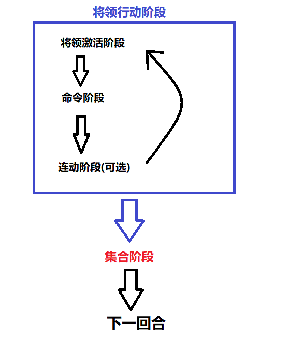
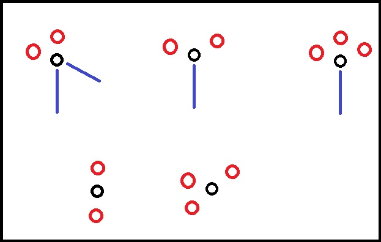

# AIG兵棋

## 1.简介

## 2.配件与术语

### 2.1. 地图

每一场战斗都在地图上发生。地图是被六角格覆盖的一块拥有各类地形的区域。地形等要素会在之后的规则部分介绍。

### 2.2. 算子

游戏中包括三类不同的算子。战斗单位算子，将领算子，以及标记算子。

#### 2.2.1. 战斗单位算子

战斗单位算子代表一定规模的，被组织起来的战斗人员。
某些战斗单位算子是双面的。背面往往代表着骑兵单位的步行状态。
战斗单位算子上有以下数据。
在战斗单位算子的顶部，标注着该战斗单位的从属。在本作中，这些单位往往需要依此来被激活。战斗单位算子的背景颜色也与其从属相关。
战斗单位算子的左侧图标直观地标识了该单位的外貌。在实际游玩中，熟练玩家可以据此快速得知该单位的一些基本属性。在这个图标的右上角有一个单位标识数字，这代表这个单位在其从属上级单位（部落，军团，etc.）当中的编号。这个编号可以被用来区分同一从属下的不同同类单位（如同一部落下属的几队同类轻骑兵）。这在收纳中会尤其有用。
每一个战斗单位都从属于一个类型。这个类型包括：具装铁骑(CT)，重骑兵(HC)，轻骑兵(LC)，重装步兵(HI)，中装步兵(MI)，轻装步兵(LI)。单位类型会影响这个单位在各种战斗结果表中的判定。
某些单位拥有远程投射能力。这些战斗单位算子会在他们的单位类型上方、部队编号右方有一个标记。字母代表了这个单位持有何种投射武器，而字母外围的形状代表了这个单位是否受过特殊投射技巧训练。
战斗单位算子右下角的数字代表了该单位的移动力。
战斗单位算子下方中间的数字代表了该单位的单位质量，TQ（Troop Quality）。

#### 2.2.2. 将领算子

将领是整个军队赖以运作的核心。将领算子具有两面，正面为未激活状态反面为激活过状态。
将领算子包含如下数据：
算子顶端是该将领的名字。注意，有一些将领没有名字：他们只有职位代称（比如轻骑兵指挥官，军团指挥官，酋长，等等）
将领的左侧有一个黑色的竖条，里面会有一些（个）星星。这代表着该将领的等级。这个数值并没有太多实际作用，等级高的将领也不一定能力就强，但是凭此你可以轻松辨认出谁是某个特定剧本里一方的总指挥官。
算子正面的正中间是一个将领头像。在反面，这个头像会被替换成一个“毕”字，代表这个将领已经结束了行动。
算子的底部有四个数字，分别代表了将领的：指挥范围-主动值-可发布的团体命令个数-以及魅力。不是所有将领都可以发布团体命令。有一些将领是不能发布团体命令的，此处会用“-”代替。

#### 2.2.3. 标记算子

标记算子往往是表示状态的。从凝聚力打击到近战状态，到弹药状态，到部队的特殊阵型，等等等等，都用标记算子表示。

### 2.3 表格与骰子

各类战斗结果通过掷骰子之后查表判定。骰子使用十面骰，结果最大为9，最小为0（注意：投骰子0面不是10，而是0）。这意味着在没有负面修正的情况下一个TQ为9的单位可以通过任何TQ检定。

### 2.4. 术语

- **D10**：10面骰子
- **正在激活的将领**：正在发布命令的将领为正在激活的将领
- **凝聚力**：一支部队保持战意、阵型的能力。一支部队的初始凝聚力等同于它的军队质量（TQ），但在之后的战斗中凝聚力可能会因为各种原因受到减少。在这个时代，一个兵队被消灭往往不是由于死伤殆尽，而是士气上的崩溃。训练精良装备优秀的部队会更难崩溃；但一旦崩溃了，在足够的精神压力下幸存者们最终也会四散奔逃。如果依然能保持战斗队形，损失惨重的一队人也可以在一个山头造成存在；但如果早已四散奔逃，无论伤亡多么轻也没有用。出于模拟的角度，本作不选取人数损伤作为主要要素进行模拟。
- **混乱**：一种骑兵特有的状态。在骑兵进行一次近战之后，骑兵单位会陷入混乱，无论此次近战中他们是否取得了胜利。此时的混乱不是指骑兵们在像没头苍蝇一样四散奔逃，而是指他们正在短兵相接，或者正在重组队形，准备接下来的机动和战斗；在这种状态下骑兵不能像之前一样列队移动或者发起冲锋。
- **未激活将领**：本回合中暂时未被激活，且接下来按照正常激活流程可以被激活的将领
- **已激活将领**：在本回合内之前的流程中已经被激活过并已处于结束行动状态的将领。完成激活流程可以使一个将领处于结束行动状态，但不是唯一方式：负伤，尝试夺取主动权失败等原因也可以让将领处于结束行动状态。
- **将领**：军队的指挥官，发布命令的英雄（以及马鹿）们。
- **移动力**：一个单位进行移动的能力以及潜力。移动力不代表一个单位可以移动的距离，一个单位的实际移动距离会受到地形等因素影响。
- **（一轮/组）射击**：本作中，远程投射是按照轮次来计算的。一次射击并不代表一根箭/标枪，而代表该单位进行的有组织的一组集体投射。一组投射不一定是齐射；一队弓箭手们按照自己的节奏进行的自由射击（Fire at will）也会被等效为一组或多组射击。
- **连动**：本作中将领可以尝试连续进行多个命令阶段的机制。
- **命令阶段**：正在激活的将领发布任何命令的阶段。
- **近战**：短兵相接的白刃战。
- **单位质量（TQ）**：TQ是对于一个作战单位最重要且直观的指标之一，综合考虑了它的装备水平，训练程度等多种因素。TQ直接决定了这个单位能多好地完成一项任务，能承受多大的打击而不崩溃，等等。
- **夺取**：一个指挥官尝试阻止另外一个指挥官进行正常的命令阶段行动并将其变成一个自己的命令阶段的机制。夺取可以发生在对立方指挥官之间，也可以发生在同方指挥官之间。
- **影响范围（ZOI)**：大部分单位都会有一个影响范围（通常在他们前方）投射到地图上，他们往往可以尝试对处于这些范围内的敌方单位进行某种程度的阻止或者妨碍。相比于更传统的控制范围（ZOC），我们认为在这个作品尝试描述的战争中战斗单位们并没有能力完全“控制”这些地域，而只能施加“影响”。举例来说，一队中装步兵并不能阻止一队敌方轻骑兵从他们面前一百米处路过跑到其他地方或者停下来对自己洒下一轮箭雨后扬长而去；但是他们可以在敌人想要这么做的时候尝试送给他们一轮标枪。

#### 战斗单位类型：

- **具装铁骑(CT)**：具装铁骑是防护最好的骑兵。骑手与坐骑都在效果较好的盔甲保护之下。具装铁骑在本作中并不常见。
- **重骑兵(HC)**：重骑兵往往也是防护极佳的骑兵，但比具装铁骑差一些。只有骑手受到良好的保护，坐骑往往没有额外保护或者只有一件马衣。
- **轻骑兵(LC)**：轻骑兵在本作中是最常见的骑手。他们只被最低限度地保护着，可能只是穿戴着一件厚重大衣——或者干脆赤膊上阵。他们极度依赖机动力优势。
- **重装步兵(HI)**：重装步兵是装备良好的步兵。他们往往穿戴着厚重的盔甲，经过系统的训练，是军中的精锐。重装步兵的具体武备会因军队的不同而有差异，但总的来说他们至少会配备一把良好的刀剑，不管是作为主武器还是为长矛折断做准备的副武器；以及能够较为有效地保护躯干的良好盔甲。
- **中装步兵(MI)**：中装步兵是比较常见的步兵。AIG居民们很快地发现这是一种经济且较为有效的武装策略。中装步兵一般拥有一部分，而不是全套的，盔甲。某些中装步兵会拥有能保护驱赶的盔甲，头盔，以及一面盾牌；另一些中装步兵可能就只有一顶破头盔，一面破木盾，尽量让自己穿的厚一点以希望能够减弱箭矢的杀伤力。
- **轻装步兵(LI)**：轻装步兵往往几乎没有保护。但没有保护并不一定意味着他们就是仓促组织起来的征召兵——对于善战的猞猁民来说尤其是如此。

### 2.5. 比例尺

尽管不同军队、不同作战单位略有不同，且在实战中各战斗单位人员也往往不处于完美齐装满员状态，在本作中一个算子约代表400名步兵，或者约200名骑兵。
地图上的每一个格子代表一块约100米长宽的区域。每一个游戏回合代表约20分钟——但从模拟的角度来说这并不一定准确。战斗的节奏时紧时慢，瞬息万变。玩家最好不要太过纠结回合实际时间的计算。

## 3.游戏流程

游戏内的“大回合”由两个大阶段组成：将领行动阶段和集合阶段。其中将领行动阶段包括三个小阶段：将领激活阶段，命令阶段，以及连动阶段。

### 3.1. 将领激活阶段

激活目前场上所有未激活将领（定义参考2.5.）中领导力最低的将领。如果有多名将领并列为领导力最低，则双方各投掷一枚D10骰子（平手重投），点数大的一方先选择这些并列领导力最低的将领中的一名己方将领进行激活，行动结束后由对方选择一名将领进行激活，交替进行。若某一方已激活完全部最低领导力的将领，则另一方按照任意顺序激活完自己剩余的最低领导力将领，直到此级领导力的所有将领都被激活完为止。

> 例子：
玩家甲此时拥有ABCDE五名领导力为2的将领，而玩家乙拥有XYZ3名领导力为2的将领。此时场上没有领导力为1的未激活将领。
由于有8名将领领导力同为2，因此甲乙投掷骰子决定激活顺序。甲1D10=7，乙1D10=2，甲获胜。因此甲先选择一名将领激活，然后乙选择，交替进行。甲乙顺次激活了A,X,B,Y,C,Z,此时乙已经激活了全部领导力为2的将领。甲此时可以按任意顺序激活自己剩下的两名领导力为2的将领DE。当A,X,B,Y,C,Z,D,E全部激活完毕之后，开始按顺序激活领导力更高的将领，直到所有将领都处于已激活状态为止。
注意，在自己激活某个将领之前，玩家可以选择暂时跳过这个指挥官并让自己的一位领导力更高的将领夺取这位本该行动的将领的行动轮。更多的详细介绍参考5.4.部分。

### 3.2. 命令阶段

被成功激活的将领可以发布命令。
命令阶段由如下两个小部分组成。

#### 3.2.1. 移动与投射阶段

在移动与阶段中，正在激活的将领可以发布个体命令或者团体命令或者旗帜集结命令。一个将领在一个命令阶段中只能从三者中选择任意一项执行。参考5.2. 
注意，有序撤退，伪退等战术行动也发生在这个环节。近战阶段通常来说只发生近战。
注意，任何一支部队在一个大回合中都只能被无惩罚激活一次。当一支已经在本回合中已经被激活过的部队再次被激活时，它先于任何动作受到一点凝聚力打击。

#### 3.2.2. 近战阶段

在一位将领结束发布命令之后，按照如下流程(参考9.1.)结算所有本轮需要进行的近战。
- a.所有被激活的，没有进行移动的，可以进行近战的(也就是说激活时原本就在与敌方单位短兵相接并且没有撤离的单位)盖上“近战-无需检定”标记
- b.所有没有此标记的近战（所有移动并进行近战的单位）进行近战前TQ检定
- c.检定将领伤亡情况
- d.结算近战
- e.崩溃检定

### 3.3. 连动阶段（可选）

刚刚完成将领激活的玩家可以选择让这位刚刚完成激活的将领尝试连动。如果成功，该将领可以重新进入激活阶段。或者该玩家可以选择不尝试连动，直接让该将领进入已激活阶段并回到将领激活阶段进行下一位将领的激活。

### 3.4. 集结阶段

- a.移除所有“集结中”以及“混乱”标记
- b.溃退移动节：所有溃退中的单位必须进行溃退移动
- c.再装填节：符合资格的远程投射单位此时可以得到弹药补充
- d.军队败退检定：双方玩家各自检查自己的军队是否达到了败退条件
- e.将将领们全部翻回未激活面，移除“已移动”等算子标记。
- 在集结阶段结束后，游戏进入下一回合。本作没有回合限制，战斗持续到任何一方取得胜利为止。

## 4.将领

作战单位在未从将领处收到命令的情况下无法进行移动和射击。将领以及指挥链是本作的核心，没有接触过Great Battles of History或者Men of Iron等作品的玩家请重点阅读规则书第4及第5部分。

### 4.1. 将领算子

将领有数个重要数值：
- 主动值：主动值代表了一名将领指挥手下军队的能力。有很多因素可能会影响一个将领的主动值：观察和理解大局的能力，对手下部队的了解程度，临场决策的速度和质量，甚至只是和传令官沟通时的效率和清晰度。主动值是现实中这读写能力的综合体现。主动值决定了将领尝试连动和夺取时的成功率，同时也决定了一位将领在命令阶段可以发布的个体命令数量（个体命令数量=主动值数值）
- 团体命令数量：高级指挥官们拥有发布团体命令的能力。这个数值代表了这名指挥官在一次激活中最多可以发布多少条团体命令。
- 指挥距离：有一些指挥官们掌握不了哪怕只距离自己四百米以外的一片平地上再发生什么，而另一些指挥官则可以运筹帷幄之中决胜千里之外。这个数值表示了一名将领可以在多大的范围内保持自己的存在并发布命令。这个数值是将领的命令可以传达到的最远的距离。
- 魅力：代表了一名将领集结部队以及在近战中为与其堆叠的部队提供肉搏增益的能力。
- 移动力：尽管没有写在算子数据上，将领单位是有移动力限制的，且所有将领的移动力都是一样的。所有将领在携带军旗的时候移动力为6，在不携带军旗的时候移动力为8。

### 4.2. 将领的能力

#### 4.2.1. 将领等级

等级（算子左侧标记）一般来说对于将领并不重要，但它们具有两个重要作用：确定指挥链上下级，以及区分作为指挥官的将领与次级将领。
将领算子也是可以被（单独或连同与它堆叠的单位）激活的。在一些情况下，例如当你的一名将领连同其所堆叠的战斗单位一起被缠入近战的时候，你可能会希望他们能够主动脱身而不是抛下指挥军队的任务不管在人堆中近战到这一场肉搏分出胜负。这种时候比他等级更高的指挥官可以通过向其发布一条个体命令来让他脱离战斗，但是与他同级或者等级更低的指挥官不能像这样使用命令帮助他脱离接触。
有一些将领不是严格意义上的“将领”：他们更像是一个军团/部落负责人的“副将”，护卫或者单纯的跟班。这些将领在等级标记处一颗星星都没有，只有一个倒三角。这些指挥官叫做基层将领。基层将领没有发布团体命令的能力，也无法按照正常的将领激活流程单独激活，但他们可以在被个体命令激活时使用其发布个体命令的能力（担当上级的传话官，“那边的那两队乡巴佬你领着走”），并且可以为与其堆叠的单位提供近战中的修正。

#### 4.2.2. 指挥范围

如果从该将领所在六角格可以通过一条长度不超过将领指挥范围的（论六角格的格数而不是直线距离）不被敌方单位，敌方单位zoi，以及不可进入地形所阻挡的线连接到一个战斗单位，那么这个战斗单位就被视作处在该将领的指挥范围内。（图例？）

#### 4.2.3. 个体命令

一个将领可以向任何处于其指挥范围内的友方单位发布个体命令。

#### 4.2.4. 团体命令

如果一个将领有发布团体命令的能力，他可以选择发布团体命令而不是个体命令。一位将领的团体命令可以激活哪些单位取决于剧本规定。当将领发布团体命令时，一次性激活所有位于其指挥范围数值双倍距离内的可激活单位。这个距离的计算方式除了采用将领算子上的指挥距离数值的两倍以外与个体命令的计算方法相同。

#### 4.2.5. 移动

将领只有在三种情况下可以移动：一是在自己给自己发布一条个体命令时（计入发布的个体命令总数），二是在自己发布团体命令时与自己所堆叠的单位一起移动，三是在接收到更上级的指挥官发布给自己的个体命令时。

#### 4.2.6. 命令限制

当一位非剧本总指挥官的将领处在近战之中时，他不可以发布任何个体或团体命令，也因此他无法自己在战斗结束时主动脱离近战。更上级的指挥官可以向其发布一条个体命令让他脱离战斗。这条命令会消耗这位更上级的指挥官2条个体命令额度。

### 4.3. 命令系统

#### 4.3.1. 总指挥官

总指挥官与其他指挥官相同，但是有一些额外的能力：
- a.总指挥官即使身处近战当中，也可以发布个体命令（但依然不能发布团体命令）。因此，他可以通过给自己发布个体命令来移动脱身。这种在近战中给自己发布的个体命令消耗2条个体命令额度。
- b.总指挥官的团体命令发布自动成功。
- c.他可以通过向那些本不属于自己本部的友军部队发送个体命令，也可以尝试向他们发布团体命令。若要如此发布团体命令，他首先要宣布向哪些单位发布团体命令，需要投掷一枚带有+1修正（不利修正）的D10骰子进行鉴定。如果结果低于他的主动值，那么他可以向这些单位发布一次临时命令。如果结果高于他的主动值，那么他尝试向这些本不从属于他的部队发布命令，但是他和这些突然接受一个不熟悉的将领的命令的指挥官没有沟通极其失败，双方都陷入了一片混乱之中。这些他尝试激活的单位本回合不能再被激活，而且这名将领本身也立刻进入激活结束状态。即使他能发布多条团体命令，一旦出现此类失败则他在本回合也不能再发布其他团体命令，但在这次测试之前发布的团体命令所激活的单位依然可以完成他们的动作。如果这次D10的原始投掷结果为“0”，则团体命令发布成功并且这些机灵的战士们立刻理解了正在发生的一切：他们在这场战斗中剩余的时间里再接受总指挥官的团体命令时不再需要投掷判定骰，团体命令发布自动成功。
- d.总指挥官指挥范围内的其他拥有发布团体命令能力的指挥官在尝试发布团体命令的时候不需检定，自动成功
- e.总指挥官可以在一个其下属阵亡或负伤时临时提拔一位伤亡指挥官属下的一位基层指挥官顶替。这个火线提拔需要对这名基层指挥官发布一个个体命令。这位指挥官会获得“团体命令数量1”的临时能力，接替伤亡指挥官原本的位置以及从属关系，并可以发布团体命令。这种临时顶替的指挥官进行总指挥官指挥范围外发布团体命令的检定时，会受到一个投掷结果+1的不利修正。

#### 4.3.2. 普通指挥官

普通指挥官是总指挥官之下，基层指挥官之上的将领。一位普通指挥官在尝试发布团体命令时，有以下两种情况：
- a.这名激活中的将领处于总指挥官的指挥范围内时，可以直接成功发布团体命令，无需检定。这名将领会在这个大回合内持续拥有这个发布团体命令无需检定的能力（即使他尝试连动成功，此时已经处在总指挥官万里之外，如果他本回合刚刚的行动中已经获得了这个无需检定的能力，他依然可以自动成功地发布团体命令）。
- b.这名激活中的将领若是尝试与总指挥官的指挥范围外发布团体命令，则需要投掷一颗D10。若结果小于或等于这名将领的主动值，发布成功；若大于主动值则失败，这名指挥官直接进入已激活状态（翻面）。
- 除此之外普通指挥官没有任何其他的发布命令的限制。他可以在移动中停下来发布一些个体命令，再前进，再停下来发布个体命令，再继续前进，只要他移动消耗的总移动力不超过他的最大移动力且他发布的个体命令数量不超过他的能力上限即可。

#### 4.3.3. 基层指挥官

基层指挥官无一例外地在编制上从属于更高级的普通指挥官，主动值一般为1，且没有发布团体命令的能力。基层指挥官不能主动激活自己，也自然不能尝试连动或者夺取：他们不参与回合大流程中的将领激活阶段。这些将领主要有三个作用：一个是率军冲锋陷阵，为与其堆叠的单位提供加成；二是在情况较为复杂的时候帮助上级将领延长通过个体命令创造的指挥链；三是在危急时刻临时顶替伤亡的上级将领。
当一个基层指挥官接收到个体命令时，他可以在被激活的同时激活自己所堆叠的战斗单位，并再额外发布等同于自己主动值个数的个体命令。

### 4.4. 将领遭遇战斗时

本部分规则大致涵盖将领在战斗中的作用。近战中将领伤亡等规则会在规则书的第九部分详细介绍。

4.4.1. 将领无法只身主动进入敌军的ZOI。将领可以与一个任意种类的作战单位算子堆叠。只有在这种情况下，将领才可以与自己所堆叠的单位一起进入敌军的ZOI。将领在离开与敌军进行的近战的时候可以选择与自己所堆叠的单位一起有序撤退，也可以选择只身离开到更安全的地方，但必须符合4.2.6. 所描述的条件。
4.4.2. 当敌军作战单位靠近一名与作战单位堆叠的将领时，玩家可以选择让将领与所堆叠的单位一起进行有序撤退。当敌军靠近一名并未与作战单位相堆叠的将领时：
a.如果敌方单位是一个步兵单位，玩家可以直接将该将领转移到其移动力可以到达的范围内最近的（耗费移动力最少的）友军作战单位（不一定是这名将领自己的下属作战单位）处。若范围内有多名距离相同移动力耗费的友军单位，将领的控制方决定他的去向。如果范围内没有友军作战单位，该将领被消灭（被击杀或俘虏）。
b.若敌方单位是一个骑兵单位，玩家需要投掷一枚D10进行检定。若该敌方单位是一个移动力为8或更高的轻骑兵单位，检定结果+1。如果检定结果小于或等于该将领的主动值，执行与4.4.2.a.一样的程序。如果检定结果大于该将领的主动值，这名将领被消灭。
计算移动力时将领依然不能进入他原本不可进入的地形，不可进入敌军ZOI（在寻找这条路径时，友军战斗单位所在格视为没有敌军ZOI），不可经过敌军所在格。如果这名将领不能在这些限制下顺利用移动力移动到友方单位身上，哪怕最近的友方单位近在咫尺他依旧会被消灭。
4.4.3. 任何被火线晋升或替换（视剧本）的将领在当回合都会处于已激活（翻面）状态。总指挥官如果被消灭不会被替换。

## 5.将领激活与发布命令

### 5.1. 如何激活将领

所有将领在回合开始之时都是未激活状态。将领在完成激活后就会翻面到已激活状态，直到回合结束下一回合开始时重新翻回未激活状态为止。

5.1.1. 每个回合开始之后，先从激活一名将领开始。先激活主动值最低的将领，如同规则第三部分中介绍的那样。当一名将领激活结束后，激活下一名将领并进入他的行动阶段，直到所有将领都处于已激活状态为止。
5.1.2. 一个将领在一个回合中最多可以最多经历三个命令阶段（也就是说，最多只能连动两次）
5.1.3 一个将领在如下状态下会进入激活完毕状态（翻面）：
a.这名将领完成了自己的命令阶段并没有进行连动的尝试（无论是选择不去尝试还是不能尝试）
b.这名将领尝试了连动或者夺取，但是失败了
c.这名将领的连动或者夺取被一名敌方将领成功夺取
d.控制这名将领的玩家选择让这名将领待命（即，没有发布任何命令就结束了命令阶段，并不尝试进行联动）
e.这名将领尝试在总指挥官的指挥距离外发布一次团体命令，但是失败了
f.这名指挥官是总指挥官，他尝试接替指挥其他友方将领的部队，但是失败了
5.1.4. 一个处于已完成激活状态的将领无论出于任何原因，在本回合内不再能发布任何命令。

### 5.2. 命令阶段

5.2.1. 一个被激活的将领可以在一个命令阶段选择以下三件事之一去做：发布个体命令，发布团体命令，或进行一次旗帜重整。一个将领在自己连动时可以进行与之前一个命令阶段不同的命令（如，可以发布团体命令，成功连动，然后发布数个个体命令），因为此时这位将领获得了一个新的命令阶段
5.2.2. 一般来说，一个个体命令可以允许玩家做出以下几件事之一：
a.激活一个单位。这个单位可以在这个命令阶段进行移动和/或射击
b.为一个战斗单位移除两点凝聚力打击
c.尝试重整一个溃逃中的战斗单位
d.火线提升一位下级指挥官（参考4.3.1.e）
5.2.3. 一个团队命令会同时激活所有处在指挥官范围两倍之内的，符合这位指挥官的团体要求的单位。这个要求会在剧本书里介绍，一般来说会是这位指挥官的下属、族人、私兵、或是被分派到他这一翼由他所负责的单位。这些被激活的单位可以在这个命令阶段里进行移动和/或射击，正如收到一个移动和/或射击的个体命令的效果一样。
5.2.4. 一个将领可以在以下条件下进行移动：
a.一个激活中的将领可以给自己发一条个体命令，然后他可以随意移动
b.一个激活中的将领可以向自己所堆叠的单位发送一条个体命令，然后与这个单位一起移动。若如此做，这位将领必须保持一直保持与这一个战斗单位堆叠，直到这个命令阶段结束的时候依旧如此。
c.一个激活中的将领若在自己发布团体命令时与一个自己可激活的单位堆叠，则他可以与这个被堆叠的单位一起激活并开始移动。但在此种情况下这位将领并不需要保持与这个战斗单位堆叠：他只需要在结束移动的时候保持至少有一个此次团体命令激活的战斗单位在自己的指挥距离内即可。
d.一个非总指挥官的将领可以在收到总指挥官的个体命令之后进行移动。若一名总指挥官在发布团体命令时有其他普通指挥官和基层指挥官与其团体命令要激活的战斗单位堆叠在同一六角格里，或当一名普通指挥官发布命令的时候有其下属的基层指挥官与其团体命令要激活的战斗单位堆叠在同一六角格里，则这些等级更低的将领们可以与自己堆叠的单位在收到团体命令时一起激活，但它们必须保持在这个命令阶段一直与同一个战斗单位一起堆叠。
e.如果一名将领在与一个战斗单位堆叠，当那个单位进行有序撤退的时候，他可以与这个单位一起撤退
5.2.5. 一个单位可以在一个游戏回合内被激活多次，但是在同一个命令阶段内一个单位只能移动和/或射击一次，也只能接受一次个体命令（不能给同一个单位发布两个个体或团体命令让一个战斗单位移动和射击两次，也不能通过两次个体命令让一个单位先移除凝聚力打击再战斗）
5.2.6. 近战与命令无关。射击与移动通过命令执行，但近战是在命令阶段内射击与移动全部结算完后的小节发生的。反应投射不需要任何命令：他们是对于敌方行为的反应，而不是主动投射。
5.2.7. 与敌人近战中的将领无法发布团体命令；但他依然可以被激活，发布个体命令，并在近战节开始时用其指挥范围内使一些单位进入近战。
5.2.8. 当一名将领发布完所有他本次命令阶段发布的命令之后，进入近战节。近战节参考第九部分。
5.2.9. 在近战节结束后，命令阶段结束。接下来这个玩家可以选择尝试进行一次连动：
a.若不进行连动，则将这名将领翻到已完成面。并激活下一个将领（未激活将领中主动值最低的将领）
b.或者，这名将领可以尝试连动来获取一个额外的命令阶段。参考5.3. 

### 5.3. 连动

5.3.1 一位未处在与敌方近战中，且并未被夺取或跳过的将领在自己的命令阶段结束时可以尝试连动（依然需要符合一个将领一个大回合内最多经历三个命令阶段的限制）。
5.3.2 若选择进行连动尝试，则投掷一枚D10骰子。若结果小于或等于该将领的主动值，则连动成功，若对方未进行夺取或者夺取失败，则这名将领再获得一次命令阶段的行动机会；若大于该将领的主动值，则连动失败，将这名将领翻到已完成面。并激活下一个将领（未激活将领中主动值最低的将领）
5.3.3. 若这次D10检定的结果为9，那么再投掷一枚骰子。
若结果为2-8，则连动失败，将这名将领翻到已完成面。并激活下一个将领
若结果为0或1，则全军陷入指挥混乱。该将领翻到已完成面。这回合的余下时间中，该将领方的玩家的所有将领都不能再因为任何原因被激活，但他的对手的将领依然可以。
若结果为9，则本回合直接进入集结阶段，不再有任何其他的将领激活在此回合发生。

### 5.4. 夺取

夺取是尝试使用一个本来无法在此时激活的将领替代本来要激活的将领的一种动作。目前正在/要激活的将领方的玩家我们成为主动方，反之他的对手我们称为被动方
5.4.1. 主动方的夺取
主动方的玩家可以尝试用自己的一名处于未激活状态的将领来夺取自己按照激活顺序本该行动的将领。举例来说，玩家可以用一名6主动值的将领来夺取一名2主动值的将领的激活（按正常激活顺序后者会先行动），来达到“插队”的效果。投掷一枚骰子，若结果小于或等于该尝试进行夺取的将领的主动值，则夺取成功。夺取成功后进行这位进行夺取的将领的行动阶段。若大于主动值，则夺取失败。夺取失败后将尝试夺取的将领翻到已激活面，由原本应当激活的将领进行行动阶段。
5.4.2. 被动方的夺取
被动方只能在两种情况下尝试夺取：夺取对手的连动，以及夺取主动方的夺取
5.4.2.1.夺取对手的连动
当对手尝试进行连动并检定成功时，被动方可以尝试进行一次夺取。被动方进行一次夺取检定。若失败（大于主动值）则被动方尝试进行夺取的将领直接翻面，进入已激活状态，主动方进行连动的将领继续行动。
若成功（小于等于主动值）则主动方尝试连动的将领直接翻面，进入已激活状态，被动方的夺取者开始行动阶段。
5.4.2.2. 夺取主动方的夺取
当主动方尝试夺取自己的将领时（即尝试“插队”时），被动方可以尝试进行一次夺取。被动方进行一次一次夺取检定.若失败（大于主动值）则被动方尝试进行夺取的将领直接翻面，进入已激活状态，主动方进行夺取的将领继续行动。
若成功（小于等于主动值）则主动方尝试连动的将领直接翻面，进入已激活状态，被动方的夺取者开始行动阶段。
注意，这次夺取如果成功的话不能被主动方再次夺取，因为此时主被动方依然没有发生交换，主动方无法夺取被动方的夺取。
5.4.3. 每次激活中各方只能尝试一次夺取。（同一次将领的激活只能被尝试一次“插队”，同一次连动或者主动方的夺取也只能被被动方尝试夺取一次）
5.4.4. 跳过
当一名玩家尝试进行一次夺取时（不管是对友方还是敌方），双方玩家的所有未激活的，主动值小于或等于这名被选来进行夺取尝试的将领的主动值的将领会得到一个“跳过”状态（举例来说，如果一名玩家用一名主动值为6的将领尝试进行了一次夺取，那么 场上所有主动值为654321的未激活将领都会得到一个“跳过”状态）。跳过状态说明战场发生了这名将领难以完全跟上的快速变化。
拥有跳过状态的将领依然可以被激活，但是无法尝试连动，无法尝试夺取。当这些将领进入已激活状态或一个游戏大回合结束的时候，他们会失去这个跳过状态。
5.4.5. 一名尝试夺取并成功的将领不能待命，也就是不发布任何命令就结束命令阶段。如果一名将领成功夺取，那么他必须发布至少一条命令让至少一个麾下战斗单位进行移动和/或射击（即不可进行重整，只能选择发布团体或个体命令），而且他指挥范围内所有可以进行近战的麾下单位都必须进行近战。注意，本条规则的移动要求有特殊限制，需要一个战斗单位进行了移动并于一个不同的六角格内完成移动，而不是进行移动后回到出发地。

## 6.移动

6.1. 广义来说，任何改变算子位置的行为都可以算作是移动，从耗费移动力的主动移动，到军队被击溃之后的溃逃，再到玩家不小心用手把算子碰到桌子底下去（当然在这种情况下，记得把算子放回原位。祝它不要被地板妖精吃掉）。但是本节中主要讨论的是主动移动，也就是被激活的单位通过耗费行动力来改变自己位置的行为。
6.2. 移动单位在进入格子时需支付相应的移动力作为移动成本。这个移动成本会因为地形等移动条件出现差异。
6.3. 任何一个算子的主动移动都必须进入其前方的相邻单元格。如果需要进入其它相邻单元格，必须先进行转向。
6.3.1. 转向花费1点移动力，可以在本格将部队算子的朝向任意改变。注意，只有当部队未属于接战状态的时候才可以进行转向动作。
6.3.2. 转向也是一种移动动作，且可以任意穿插在主动移动之间。举例来说，只要移动力足以支付成本，一个单位可以先转向，再移动一格，再转向，再移动...
6.3.3. 如果一次转向动作满足以下两个情况之一：a. 转向单位在本轮激活中受到了敌方单位的远程投射（如，受到了反应射击或者还击），b. 转向单位正在受到敌军的冲锋，那么这个转向动作被称作临机转向。进行临机转向的单位必须士气检定，如果失败会无视当前TQ直接溃退。
6.3.4. 如果一支部队已经处于近战过程中，那么可以尝试在近战中转向。在这种情况下，先立刻遭受两点TQ打击，然后进行一次士气检定。如果失败，或者如果这次转向导致这支部队溃退，这支部队会直接被消灭（而不是溃退）。
6.4. 有一部分单位拥有在移动阶段中穿插射击的技能，这部分单位会在算子上有一个“s”的标识。举例来说，这些单位可以移动接近敌人，射击，转向，再通过移动远离敌人。但没有任何单位可以将近战穿插入移动动作。6.5. 对于任一部队来说，它的整个移动流程必须被提前安排好，再一次性执行。举例来说，一个骑兵单位如果决定接近敌人-转向-射击-转向-再远离敌人，就必须把这个流程执行完毕。即使因为射击的时候受到了敌人的还击，也不能当场改变命令不进行临机转向。（可以理解为，在实际战斗中如果队长向自己的士兵传达命令后开始执行，很难在执行过程中突然叫停并开始传达一个新的命令。在冲锋过程中取消冲锋并进行未经提前传达的转向只会导致混乱。）
6.6. 部队不能通过主动移动通过已经由（未溃退的）敌方部队占据的格子。步兵单位和轻骑兵单位不能主动移动通过任何由己方部队占据的格子。重骑兵单位（HC）和具状铁骑（CT）可以移动通过友方步兵单位占据的格子，但如果这样做它们自己会遭受一点凝聚力打击并额外花费一点行动力，被通过的友方步兵会受到两点凝聚力打击。

## 7.阵型，朝向与影响区域

7.1 每个部队算子的摆放遵循以下原则：（例图）
算子信息阅读方向的上端永远对着的是六角格的一个角，与这个角相邻的两条边视为正面；与阅读方向的下端的角相邻的两条边视为背面；剩下的两条边视为侧面。部队的方向会涉及到这支军队在战斗中的功效。
7.2. 有一些部队可以主动结成特殊的阵型，这些阵型可能会不完全遵照7.1.的规则。具体如下：

7.3. 骑兵有一种特殊的阵型，混乱状态。这反映的是骑兵们散做一团，各自为战的状态。无论在任何情况下骑兵一旦发起或被发起近战，都会自动进入混乱状态。当一个不处于混乱状态的骑兵受到远程投射时，需要进行一次士气检定。如果失败，进入混乱状态。
7.3.1. 属于混乱状态的骑兵六面都视为正面，但是在近战/被投射的时候额外遭受一列的不利修正。混乱状态的骑兵只能向已经与自己处于交战状态的敌人发起近战。混乱状态的骑兵不能进行远程投射或者还击。
7.3.2 混乱状态的骑兵的移动力为6。 如果正在与自己交战的敌方不包含骑兵，那么可以进行脱离动作：先立刻遭受两点TQ打击，然后进行一次士气检定。如果失败，或者如果这次脱离导致这支部队溃退，这支部队会直接被消灭（而不是溃退）。然后使用6点移动力进行移动（与6.3.4很相似，但是可以额外执行移动）。

## 8.溃退与消灭

8.1. 当一个部队凝聚力降为0（收到的打击大于或等于TQ值的时候），就会进入溃退状态。但需注意，这不是唯一的溃退条件（比如当临机转向失败时，也会直接溃退）。
8.1.1 溃退的部队会首先向着远离最近的敌人的方向直线移动两格，用其移动力属性所允许的最大值移动尽可能远的距离，之前两格的移动力也计入其中（如果有多个可能，则溃退单位的控制方决定如何移动）。在溃退的部队上放置一个溃退标记。
8.1.2 溃退的部队不能进入敌方单位的ZOI，如果进入就会立刻被消灭。溃退的部队不能跨越河流（但是小溪没问题），不能跨越不可通过地形，如果不得不像河流或不可通过地形的方向移动会被直接消灭。

（后期需要替换的草率示意图：当有多个敌方单位同时靠近友方单位时友方溃退，会先向着蓝色方向移动两格，如8.1.1所述。在123三种情况下，要向蓝色方向移动两格。如果在45这类情况下，溃退单位已经被敌方单位，敌方zoi，或者不可通过地形完全包围，这个溃退单位会直接被消灭。）
8.2. 溃退状态的单位会在每个大回合的最后，所有指挥官都已经激活完毕之后，向着军旗位置移动三格（无视地形移动力需求，但是依旧无法通过不可穿行地区），尽可能地靠近军旗。
8.2.1. 溃退单位的撤退路线只会绕开不可通行的地形，且只会走直线（当有多条线路可以被视为“直线距离”的时候，由溃退单位的控制方选择）。当溃退单位撞上河流，敌方单位，或者敌方ZOI的时候，直接被消灭。
8.3. 当溃退的单位处军旗三格范围之内时（无论是因为它们的移动还是因为军旗携带者的移动），会自动进行一次军旗重整。投掷一枚D10, 如果结果小于或等于部队的TQ的一半（向上取整），则重整成功。如果大于部队的TQ的一半，则重整失败，部队被消灭（溃散了）
8.3.1. 如果携带军旗的单位是敌方单位（敌方成功夺取了军旗），那么溃退单位在进入三格范围内之后不会重整，而是直接当场被消灭
8.3.2. 如果军旗重整时部队处在一个指挥官的指挥范围内，投掷的骰子结果-1
8.4. 未溃退的部队可以移动到敌方溃退单位所在的格子。如此可以直接消灭该溃退单位。但如果单位的移动过程中ZOI经过了敌方溃退单位，溃退的敌方单位不会被消灭。

## 9.远程投射

9.1. 有一部分部队可以进行远程投射动作。每支部队在一次激活中只可以发起一次远程投射
拥有这个能力的部队会在算子右侧有一个红色的小圈，圈内由白色字母标记武器种类。具体对应如下：

复合弓 单体弓 投石索 标枪 火枪

9.1.1. 如图所示，不同种类的远程武器有不同的射程和弹药量。
数字代表（修正后）所需的命中点数。如果修正后结果小于等于这个点数，则攻击命中。
攻击命中时，被攻击单位会受到一点凝聚力打击。
9.1.2. 火枪
9.2. 还击
有一部分单位拥有还击能力，这些单位的红色远程武器标记下会额外有一个字母R。这代表当他们受到远程投射攻击时，如果在受击结算完毕之后依然保持正常状态，可以自动对向他们发动射击的单位进行一次远程投射（如果此时敌人在射程范围内，且还击者有弹药）。这个动作被称为还击。还击如正常的远程投射一样结算，但不会再触发被还击方的还击。
9.3. 临机射击

9.4. 弹药耗尽

## 10.短兵相接

## 11.战斗结果

让一群普通的士兵在安全的地方冷静下来，重组队列很简单，但即使是军神在世也无法骑在马上靠一条肉嗓子让已经四散逃命到天涯海角的一群精兵重拾战意并回归战斗队形了。

## 12.战斗效果

## 13.撤退与胜利

